<div align="center">

# Flight Finder

**The price trail airlines don't show you.**

Track flight prices over time. Self-hosted. Open source. Bring your own LLM.

[](https://github.com/affromero/flight-finder/releases/latest)
[](https://github.com/affromero/flight-finder/actions/workflows/ci.yml)
[](https://github.com/affromero/flight-finder/actions/workflows/gitleaks.yml)
[](https://github.com/affromero/flight-finder/pkgs/container/flight-finder)
[](https://github.com/affromero/flight-finder/blob/main/LICENSE)
[](https://www.typescriptlang.org/)
[](https://nextjs.org)
[](https://prisma.io)
[](https://socket.dev)
[](https://docs.npmjs.com/cli/v10/using-npm/config#min-release-age)
[](https://github.com/affromero/flight-finder/pulls)
[](https://ko-fi.com/afromero)
[](#quick-start)
[](#quick-start)
[](#quick-start)
[](https://github.com/affromero/flight-finder/blob/main/AGENTS.md)
[](#quick-start)

<br>

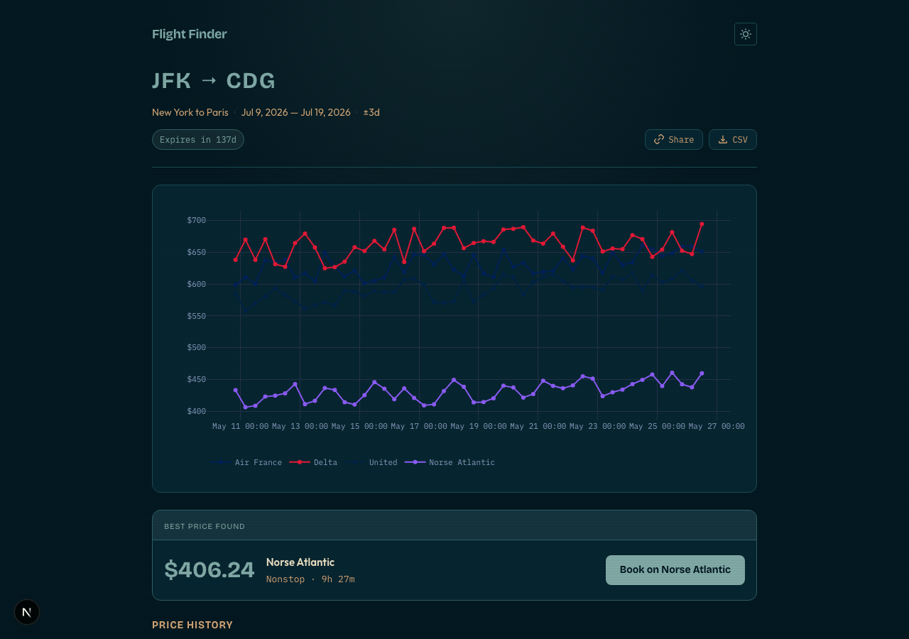CDG, LAX->NRT, ORD->FCO" width="100%">

<details>
<summary>CLI Demo -- headless mode with Claude Code & Codex</summary>
<br>

</details>

<details>
<summary>Screenshots</summary>
<br>
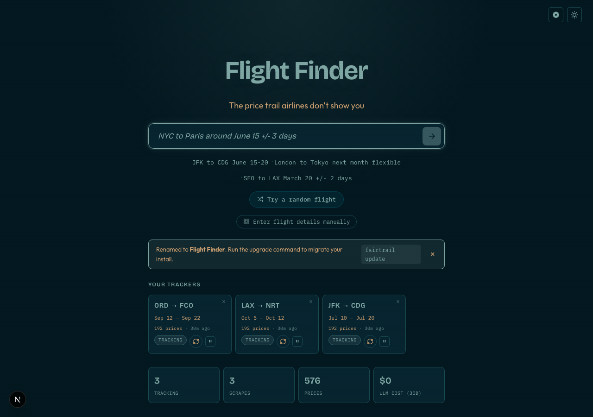
<br><br>
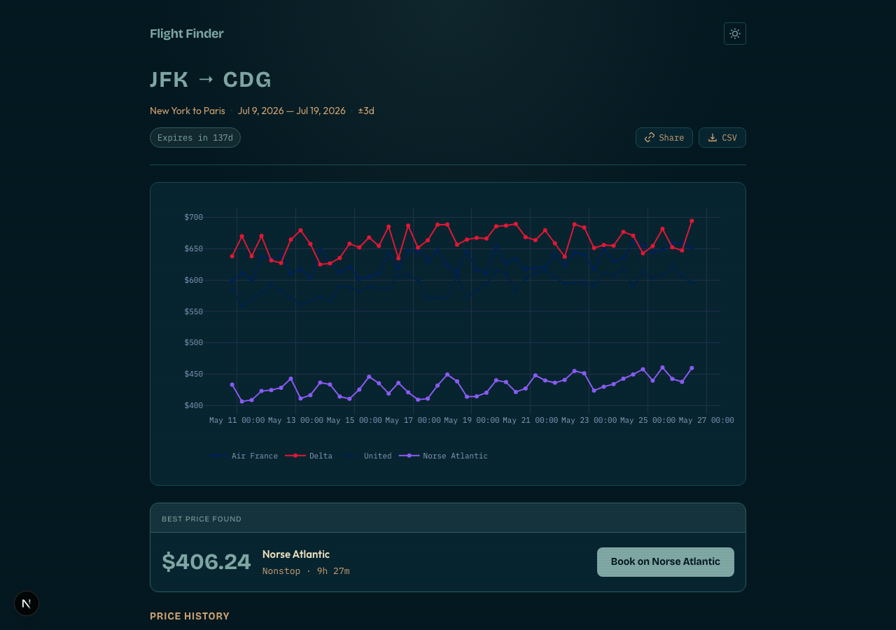 CDG price chart" width="100%">
</details>

</div>

---

## Migrating from Fairtrail?

Already running an install from before the rename? `fairtrail update` does everything for you: renames the database from `fairtrail` to `flight_finder`, moves `~/.fairtrail` to `~/.flight-finder`, pulls the new image, and keeps your tracked queries, prices, and settings intact. The `fairtrail` command itself keeps working as a deprecated alias through v1.0. Details and a manual fallback live in [MIGRATION.md](MIGRATION.md).

## Quick Start

```bash
curl -fsSL https://flight-finder.org/install.sh | bash
```

If you have [Claude Code](https://docs.anthropic.com/en/docs/claude-code) or [Codex](https://github.com/openai/codex) installed, the setup script detects it automatically. Otherwise, it asks you to paste an API key.

Once it finishes:

1. Open [localhost:3003](http://localhost:3003)
2. Or run `flight-finder search "NYC to Tokyo in July under $800"`
3. Flight Finder starts tracking prices immediately

### Prefer not to touch the terminal?

There is a **desktop app** (macOS, Windows, Linux) at [flight-finder.org/download](https://flight-finder.org/download). Open it and pick one of two modes:

- **Run it on this computer** -- it brings up the same Docker stack with one click (Docker required) and opens the app.
- **Connect to an instance** -- point it at a Flight Finder running on your VPS and it opens in its own window.

It is a thin launcher over the same installer described above; the source lives in `apps/desktop`.

### Reach it from a phone

Phones connect through the browser: open your instance URL and **Add to Home Screen** to install it as an app (it is a PWA). Visit **`/connect`** on your instance for a QR code and step-by-step iOS/Android instructions.

Admins also get an interactive reach guide in **Instance settings -> Reach it from other devices**: pick a method (Wi-Fi, Tailscale, Cloudflare, your own domain) and it walks the OS-specific steps, then takes the resulting URL.

Every option below is a terminal command, so a headless VPS can both run **and** expose Flight Finder over SSH with no GUI. Opening the URL on a phone needs an **https** one (service workers require a secure context); the LAN option is http and can be opened in the browser but not installed as an app. Pick one:

- **Same network** (http, quickest): find the machine's IP (`hostname -I | awk '{print $1}'` on Linux, `ipconfig getifaddr en0` on macOS) and open `http://<that-ip>:3003` on a phone on the same Wi-Fi.
- **Tailscale** (private https, no domain): install Tailscale on the VPS and your phone, then `tailscale serve 3003` for private https on your tailnet (or `tailscale funnel 3003` to expose it publicly).
- **Cloudflare tunnel** (public https): a throwaway URL with no account is `cloudflared tunnel --url http://localhost:3003` (prints a temporary `https://…trycloudflare.com`). For a **permanent** URL on a domain you've added to Cloudflare:
  ```bash
  cloudflared tunnel login
  cloudflared tunnel create flight-finder
  cloudflared tunnel route dns flight-finder flights.yourdomain.com
  cloudflared tunnel run --url http://localhost:3003 flight-finder
  ```
- **Domain + auto HTTPS** (permanent): point a domain at the server and put [Caddy](https://caddyfile.com) in front. A ready Caddyfile lives at the repo root; it reverse-proxies `localhost:3003` and provisions Let's Encrypt TLS automatically. Replace the site address with your domain.

The installer offers to start the Cloudflare quick tunnel for you at the end, and these same methods are walked step by step in **Instance settings -> Reach it from other devices** inside the app.

Multiple people connect to one instance with multi user mode (see the Multi user mode section below): each gets their own login (or a passwordless tap-to-sign-in face), trackers, profile avatar, and personal light/dark theme.

## Why Flight Finder?

Airlines change flight prices hundreds of times a day. They use dynamic pricing to maximize what you pay. **No one shows you the price trend because the companies with the data profit from hiding it.**

<details>
<summary>The longer version</summary>

1. **Aggregators want you inside their app.** Google Flights and Hopper track price history internally but lock it behind your account.
2. **"Buy or Wait" is more profitable than transparency.** A black-box prediction keeps you dependent on their platform.
3. **Airlines don't want price transparency.** If you can see that a route dips 3 weeks before departure, that undermines dynamic pricing.

Flight Finder exists because the data is useful to *you* -- just not to the companies that have it.
</details>

### What you get

- **Natural language search** -- `"NYC to Paris around June 15 +/- 3 days"`
- **Price evolution charts** -- see how fares move over days and weeks
- **Shareable links** -- send `/q/abc123` to anyone, no login required
- **Direct booking links** -- click any data point to go straight to the airline
- **Airline comparison** -- see which carriers are cheapening vs. getting expensive
- **VPN price comparison** -- test the myth: do prices change when you browse from different countries?
- **Self-hosted** -- your searches stay private, your data stays on your machine
- **Agent-friendly API** -- hook Claude Code, Codex, or any agent into your instance

## VPN Price Comparison

Test the myth that VPN location affects flight prices. Flight Finder can scrape the same query from multiple countries and show the results side by side.

### How it works

1. An [ExpressVPN](https://www.expressvpn.com) sidecar container runs alongside Flight Finder
2. For each scrape run, Flight Finder routes Playwright through the VPN's SOCKS5 proxy
3. All browser signals align to the target country (see full list below)
4. Your local (no VPN) price is always captured as a baseline
5. The chart shows a per-country comparison view

### Anti-detection: what Flight Finder does beyond switching your IP

Changing your IP is not enough. Websites detect mismatches between your IP and browser signals. Flight Finder aligns everything to match the target country:

| Signal | What Flight Finder does |
|--------|-------------------|
| **IP address** | Routed through VPN exit node via SOCKS5 proxy |
| **Timezone** | `timezoneId` set to match the country (e.g. `Europe/Berlin` for DE) |
| **Language** | `Accept-Language` header and `navigator.languages` aligned to locale |
| **Geolocation** | Geolocation API returns capital city coordinates |
| **Google hint** | `gl=` country parameter set on Google Flights URL |
| **WebRTC** | ICE candidates blocked -- real IP never exposed via `RTCPeerConnection` |
| **DNS** | Queries forced through the SOCKS5 proxy (`--host-resolver-rules`) |
| **Canvas fingerprint** | Subtle pixel noise injected per session to randomize `toDataURL` hash |
| **WebGL fingerprint** | Unmasked renderer/vendor strings spoofed via `WEBGL_debug_renderer_info` |
| **AudioContext** | Micro-noise added to `getFloatFrequencyData` output |
| **Screen dimensions** | `screen.width/height`, `outerWidth/Height`, `availWidth/Height` matched to viewport |
| **Exit verification** | After connecting, exit IP is geolocated to verify the country matches |

### Setup

1. During install, say **yes** to "Set up ExpressVPN?" and paste your [activation code](https://www.expressvpn.com/setup) -- or paste it later in **Settings**
2. The VPN sidecar starts automatically with Flight Finder (no extra commands needed)
3. When creating a new tracker, toggle **"Compare prices from different countries"** and pick which countries to compare
4. Each scrape run: local baseline first, then each VPN country sequentially
5. On the chart page, use the **view filter** to switch between:
   - All countries (full detail)
   - Country comparison (cheapest price per country over time)
   - Local only / individual country isolation

<details>
<summary>docker-compose.vpn.yml details</summary>

The VPN sidecar uses [`misioslav/expressvpn`](https://hub.docker.com/r/misioslav/expressvpn) and exposes:
- SOCKS5 proxy on port 1080 (internal, used by Playwright)
- REST API on port 8000 (internal, used by Flight Finder to switch countries)

Requirements:
- `EXPRESSVPN_CODE` in `~/.flight-finder/.env`
- Docker host must have `/dev/net/tun` (kernel TUN module)
- The sidecar needs `NET_ADMIN` capability

Only Playwright traffic goes through the VPN. Database, Redis, and web UI traffic stay on normal Docker networking.
</details>

<details>
<summary>Supported countries</summary>

US, GB, DE, FR, ES, IT, NL, IE, JP, KR, IN, AU, CA, MX, BR, AR, CO, TH, SG, HK

Each country profile aligns: locale, timezone, Accept-Language header, and geolocation to match the VPN exit point. Currency stays user-controlled (independent from VPN country).
</details>

## Requirements

- [Node.js](https://nodejs.org/) >= 22 (for local development; not needed for the Docker install path)
- [Docker Desktop](https://docs.docker.com/get-docker/)
- One of:
  - [Claude Code](https://docs.anthropic.com/en/docs/claude-code) (free with Claude Pro/Max)
  - [Codex](https://github.com/openai/codex) (free with ChatGPT Pro)
  - An API key from Anthropic, OpenAI, or Google
  - [Ollama](https://ollama.com), [llama.cpp](https://github.com/ggml-org/llama.cpp), or [vLLM](https://docs.vllm.ai)

<details>
<summary>LLM Providers</summary>

Flight Finder needs an LLM for two things: parsing natural language queries and extracting price data from Google Flights pages.

| Provider | Auth | Cost | Notes |
|----------|------|------|-------|
| **Claude Code** | Auto-detected (host `~/.claude`) | Free (Pro/Max plan) | Subscription CLI |
| **Codex CLI** | Auto-detected (host `~/.codex`) | Free (ChatGPT Pro) | Subscription CLI |
| **Anthropic** | `ANTHROPIC_API_KEY` | Pay-per-token | Claude Haiku 4.5 (default) |
| **OpenAI** | `OPENAI_API_KEY` | Pay-per-token | GPT-4.1 Mini |
| **Google** | `GOOGLE_AI_API_KEY` | Pay-per-token | Gemini 2.5 Flash |
| **Ollama** | None (local) | Free | Select in admin UI |
| **llama.cpp** | None (local) | Free | Select in admin UI |
| **vLLM** | None (local) | Free | GPU-accelerated (port 8000) |
| **OpenAI + custom URL** | `OPENAI_BASE_URL` | Varies | OpenRouter or any OpenAI-compatible endpoint |

**Three ways to use Flight Finder:**

- **Subscription users** (Claude Pro/Max, ChatGPT Pro) -- auto-detected, auth tokens mounted read-only.
- **API key users** -- paste a key, passed via env var, never written to disk.
- **Local model users** -- select Ollama/llama.cpp/vLLM in the admin UI, type your model ID.

**Picking a local model (Ollama, llama.cpp, vLLM):**

The parse step needs a model that follows strict JSON instructions. Tiny models tend to ramble or refuse. Stick with current generation families that have reliable structured output. Qwen3 / Qwen3.5 currently have the most stable tool calling and JSON behaviour in the small model class; Gemma 3n / Gemma 4 are strong alternatives with native function calling on the laptop tier.

* **CPU only, tight RAM**: `qwen3:0.6b` (523MB) or `qwen3.5:0.8b` (1.0GB). JSON mode is forced server side, so even these can produce parseable output.
* **CPU only, typical desktop**: `qwen3:1.7b` (1.4GB) or `qwen3:4b` (2.5GB, sweet spot if you have the RAM).
* **CPU or GPU edge (5 to 8GB)**: `gemma3n:e2b` (5.6GB, 32K context) or `gemma4:e2b` (7.2GB, 128K context, newer).
* **GPU (8GB+ VRAM)**: `qwen3.5:9b` (6.6GB, best JSON quality and speed balance), `qwen3:8b` (5.2GB), or `gemma4:e4b` (9.6GB, native function calling).

Avoid models under 1B (TinyLlama, etc.) and older generations (Llama 3.x, Qwen 2.5). They tend to ramble even with JSON mode forcing valid syntax, because the field values still need to be semantically correct. For slow CPUs, bump `EXTRACT_TIMEOUT_MS` in `.env` if larger models keep timing out (default 90000).
</details>

## How It Works

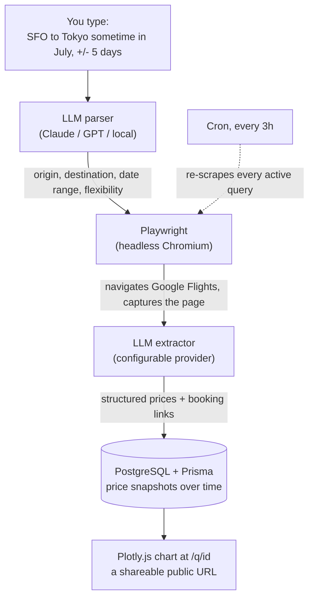

The built-in cron runs on a configurable interval (default: every 3h). Each run captures prices across all active queries and the chart pages update automatically.

## Scraping Constraints

Flight Finder walks an ordered chain of price sources per query. The chain is admin allowlisted and per user orderable. Each source has different reliability:

| Source           | Default | Reliability     | Notes |
|------------------|---------|-----------------|-------|
| Google Flights   | on      | High            | Three URL rotation + stealth context. Rate limit kicks in around 30 sustained requests per IP. |
| Airline direct   | on      | High when supported | URL templates in `airline-urls.ts`. Falls through to the next source when an airline returns a stub page. |
| Skyscanner       | off     | **Experimental** (40 to 70 percent in burst, drops under sustained load) | Cloudflare interstitials + bot detection. v1 is best effort. |
| Kayak            | off     | **Experimental** (similar to Skyscanner) | PerimeterX bot detection. v1 is best effort. |

Skyscanner and Kayak are off by default. Admin enables them in `/admin/config`; users then order them in `/account/settings`. When a source returns no flights the next source in the chain runs; an `all_filtered_out` result (real flights existed but query filters excluded them) short circuits the chain because changing sources cannot help.

For Skyscanner and Kayak to be production grade you would need residential proxies or paid CAPTCHA solving, neither of which Flight Finder ships. If those sources fail consistently for your route, leave them off.

## Managing Flight Finder

```
Usage: flight-finder [command]

Commands:
  (none)       Start Flight Finder (Ctrl+C to stop)
  search ".."  Search and track a flight from the terminal
  start        Start in background
  stop         Stop -- pauses all price tracking until you start again
  logs         View live logs
  status       Check if running
  update       Pull latest version and restart
  version      Show version and commit
  uninstall    Remove Flight Finder and all data
  help         Show this help

Account recovery (self hosted multi user mode):
  reset-password <username> <password>   Set a new password for a user
  disable-accounts                       Turn multi user mode off (no login required)
```

<details>
<summary>Headless CLI</summary>

Run Flight Finder entirely in the terminal:

```bash
flight-finder --headless                              # Interactive search wizard
flight-finder --headless --backend claude-code        # Use Claude Code as AI backend
flight-finder --headless --backend codex              # Use Codex as AI backend
flight-finder --headless --list                       # Show all tracked queries
flight-finder --headless --view <id>                  # Live price chart (auto-refreshes every 30s)
flight-finder --headless --view <id> --tmux           # Split grouped routes into tmux panes
```

Without `--headless`, `--view` opens the chart in your browser and `--list` opens the admin dashboard.

**Features:**
- Natural language search, same as the web
- Braille chart with per-airline colored trend lines
- Live refresh with countdown bar
- Multi-destination ("Frankfurt to Bogota or Medellin")
- tmux integration for grouped routes
- Backend selection: `--backend claude-code|codex|anthropic|openai|google|ollama|llamacpp|vllm`


</details>

<details>
<summary>Configuration</summary>

All settings are in `~/.flight-finder/.env` (generated by the installer):

| Variable | Default | Description |
|----------|---------|-------------|
| `ANTHROPIC_API_KEY` | -- | Anthropic API key |
| `OPENAI_API_KEY` | -- | OpenAI API key |
| `OPENAI_BASE_URL` | -- | Custom endpoint (vLLM, OpenRouter) |
| `GOOGLE_AI_API_KEY` | -- | Google AI API key |
| `OLLAMA_HOST` | `http://localhost:11434` | Ollama server address |
| `POSTGRES_PASSWORD` | `postgres` | Database password |
| `ADMIN_PASSWORD` | Auto-generated | Admin panel password |
| `CRON_ENABLED` | `true` | Enable built-in scrape scheduler |
| `CRON_INTERVAL_HOURS` | `3` | Hours between scrape runs |
| `HOST_PORT` | `3003` | Host port for Flight Finder |
| `EXPRESSVPN_CODE` | -- | ExpressVPN activation code (for VPN comparison) |
</details>

<details>
<summary>Multi user mode (households)</summary>

Self-hosting Flight Finder with your spouse, your roommates, or your whole
family? Multi user mode gives each person their own login, their own
trackers, and their own preferences. Everyone watches their own flights
without seeing each other's dashboards. You stay admin.

#### When you want this

- Two or more people sharing one self-hosted instance
- Each person tracks different flights (work travel vs. personal trips)
- Different default currencies or preferred airlines per person
- You want the admin panel back to yourself

If you're the only user, leave it off — solo mode is simpler.

#### Turning it on

You can enable multi user mode two ways:

1. **During setup**: the last (optional) step of the setup wizard asks
   "Run Flight Finder for a household?". Flip it on, pick a username and
   password, and you're done.
2. **Later from Settings**: open `/settings` -> Multi user mode and
   toggle it on. Same form, no restart needed.

When you enable, three things happen atomically:

1. Your first admin User is created (the username and password you typed)
2. `ExtractionConfig.multiUserMode` flips to true
3. Every existing tracker you already had is reassigned to your new
   admin account, so nothing disappears

#### Day to day

Once enabled, Flight Finder behaves like a normal multi-account app:

- `/login` replaces the password-only admin form — same page for admins
  and non-admins (post-login redirect picks `/admin` vs `/account` based
  on the user's role)
- Each user has `/account` showing only their own trackers, reached from
  an avatar menu in the top-right that is the same on every page
- Each user has `/account/settings` for currency, country, preferred
  airlines, cabin class, and a **personal theme**. Themes come as colour
  families (Altitude, Midnight, Cyberpunk, Tron, Autumn, Solar), each with
  a matching light and dark palette; the toggle flips within the chosen
  family. Members override the admin's instance default with their own.
- Members can be **passwordless**: leave their password blank and the
  `/login` screen becomes a "Who's using Flight Finder?" picker where each
  person taps their face to sign in, Netflix style. Add a password only if
  the instance is exposed to the public internet.
- You (admin) get a new `/admin/users` page to add household members,
  reset their passwords, promote them to admin, or delete them
- The landing search bar is gated on a session — anonymous `POST
  /api/queries` returns 401 so no orphan trackers leak in
- Share links `/q/[id]` stay public — that's the whole point of a share
  link; you can still send a chart to anyone

A one-time banner on `/admin/users` reminds you to reassign any trackers
that got backfilled to you but actually belong to a household member.
Click into `/admin/queries`, edit the tracker, set `userId` to the
right person.

#### What it does NOT do

- It is **not** offered on flight-finder.org — the public site is single
  tenant by design and will never have signup
- It does **not** introduce email, password reset flows, or OAuth —
  admin creates accounts manually and resets passwords from the panel
- It does **not** restrict cron, the headless CLI's read views, or
  share links — those work the same in both modes

#### Locked out?

Forgot the admin password, or want the accounts gone entirely? Two recovery
commands run from the host. They exec inside the `web` container, so it has
to be running:

```bash
flight-finder reset-password <username> <new-password>   # set a known password, keep accounts
flight-finder disable-accounts                           # turn multi user mode off entirely
```

`reset-password` sets a new password for any user; log in with it, then
manage everyone else from `/admin/users`. `disable-accounts` flips multi
user mode off and clears the stored admin credential, dropping the instance
back to solo self hosted mode where no login is required at all. Your
trackers survive either way. (The password you pass to `reset-password`
is visible in your shell history and in the host process list while the
command runs, so treat it as throwaway and change it once you are back in.)

Never enabled multi user mode and forgot the solo admin password instead?
Set `ADMIN_PASSWORD` in `~/.flight-finder/.env` and restart.

#### Screenshots

<details>
<summary>Setup wizard - new "Accounts" step</summary>

The wizard gets one new optional step at the end (self-hosted only).
Skip it if you're solo.

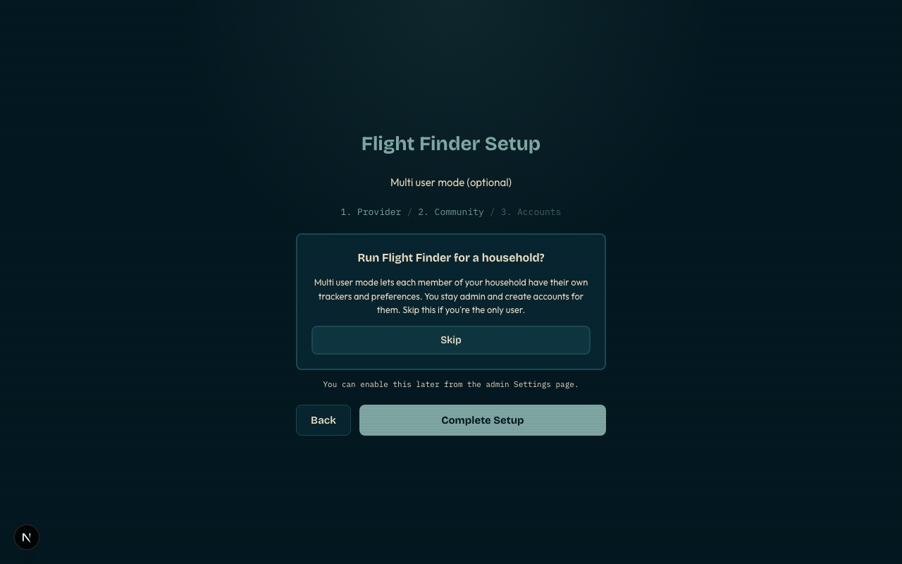

Flip the toggle on and the form expands for the admin username and
password:

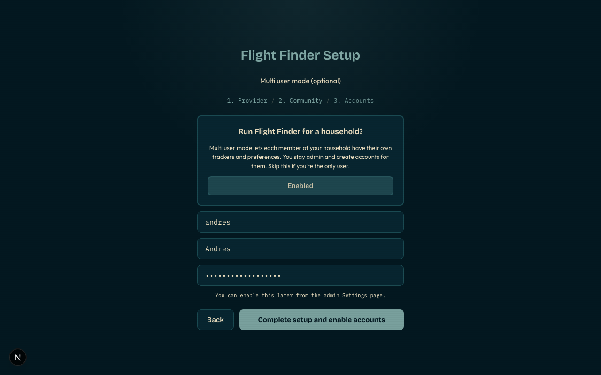

</details>

<details>
<summary>Login - unified form</summary>

One login page for everyone. Post-login redirect picks `/admin` or
`/account` based on whether the user is admin.

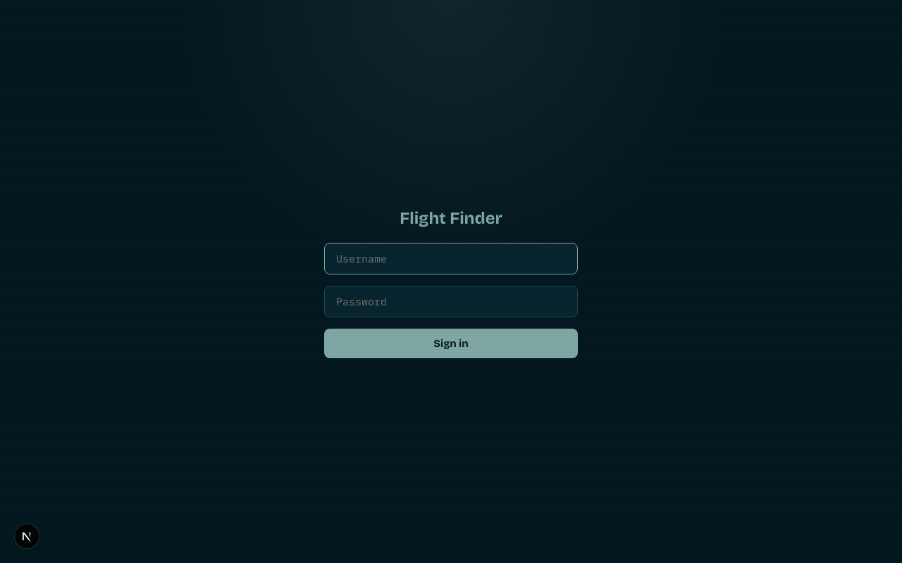

</details>

<details>
<summary>Admin dashboard - new "Users" link</summary>

The admin nav gets a "Users" link and a Logout button in multi user
mode (the existing self-hosted nav had no logout because there was no
session).

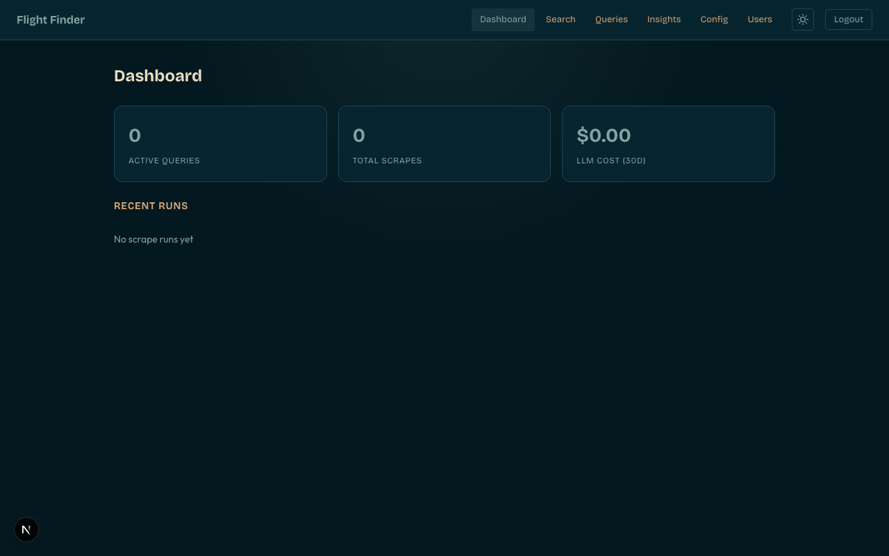

</details>

<details>
<summary>Admin users page - backfill banner + table</summary>

First visit after enabling shows a dismissible banner with the backfill
count. Add new household members with the form below.

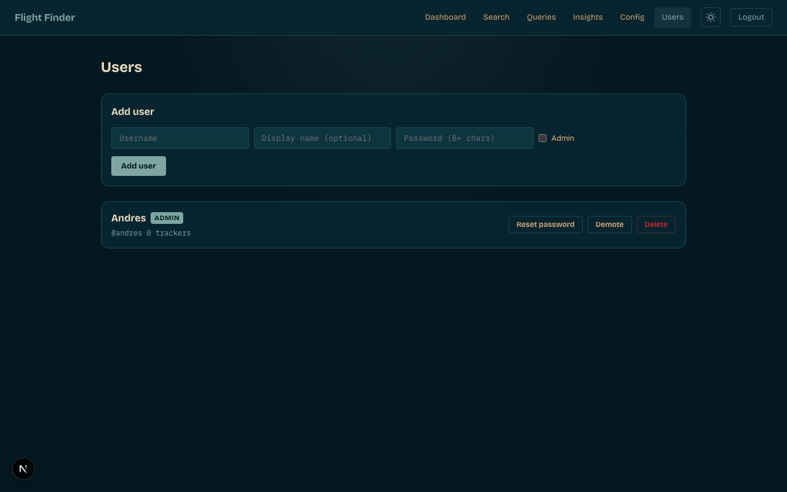

After adding a second user:

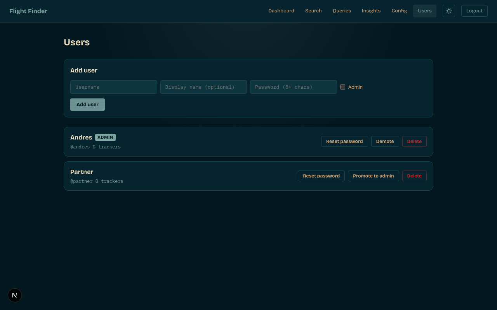

</details>

<details>
<summary>Settings - multi user mode section</summary>

Once enabled, Settings shows a link to the user management page.

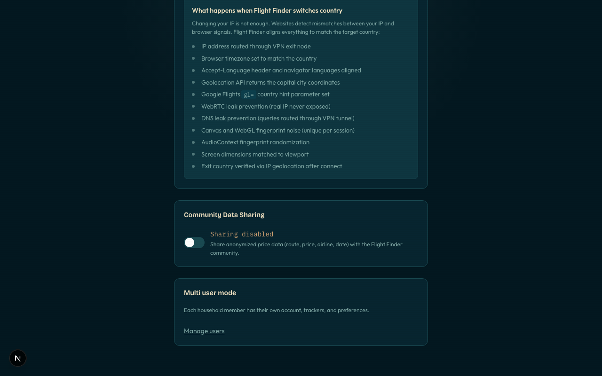

</details>

<details>
<summary>Account - per user trackers</summary>

Each non-admin user sees only their own trackers. Empty state for a
new account looks like this:


The matching settings page lets each person set their own defaults:

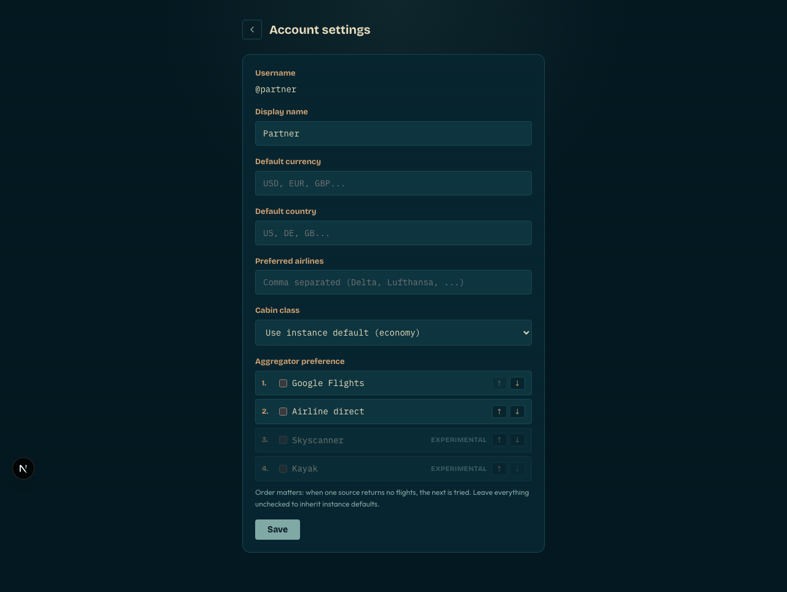

</details>

<details>
<summary>Landing - welcome line for logged-in users</summary>

Small "Signed in as ..." line replaces the silent state from solo
mode, with quick links to `/account` and logout.

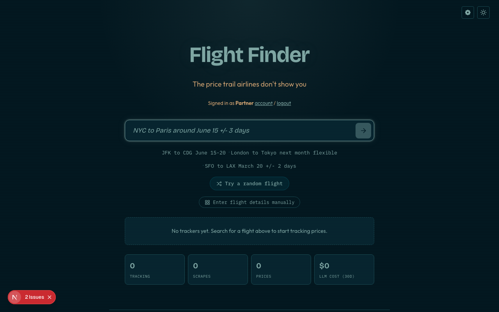

</details>

</details>

<details>
<summary>Why self-host instead of using flight-finder.org?</summary>

- **It can't work any other way.** A centralized service scraping Google Flights gets IP-banned within days. Thousands of self-hosted instances, each making a few quiet requests from different IPs, is the only architecture that survives.
- **Your searches stay private.** No one sees what routes you're watching.
- **You control the scrape frequency.** Default is every 3 hours. Want every hour? Change one setting.
- **Free with Claude Code, Codex, or a local model.**
- **Your data, your database.** Price history lives in your own Postgres.
</details>

<details>
<summary>Community Data</summary>

Flight Finder is fully decentralized. You run everything on your own machine.

**Why share?** The price trail gets richer the more instances pool their history. When you opt in, your anonymized data points join a shared fare dataset everyone can explore, and you get community prices back on routes you have not scraped yourself. It is genuinely opt-in, reversible any time, and never touches anything personal.

**flight-finder.org** aggregates anonymized price data that self-hosted instances **opt in** to share.

**What gets shared (opt-in only):** route, travel date, price, currency, airline, stops, cabin class, scrape timestamp.

**What is never shared:** your queries, search history, preferences, API keys, IP address, or identity.

Turn on **Community Data Sharing** in Settings (or during setup) to contribute. If you run a shared hub that other instances contribute to, enable **Accept community registrations** in the same panel (off by default; rate limited and globally capped). Explore community data at [flight-finder.org/explore](https://flight-finder.org/explore).
</details>

<details>
<summary>Agent & CLI Integration</summary>

Your local instance exposes a REST API. See [`API.md`](API.md) for the full reference.

```bash
# Parse a natural language query
curl -s -X POST http://localhost:3003/api/parse \
  -H "Content-Type: application/json" \
  -d '{"query": "NYC to Paris around June 15 +/- 3 days"}' | jq .

# Create a tracked query
curl -s -X POST http://localhost:3003/api/queries \
  -H "Content-Type: application/json" \
  -d '{ ... }' | jq .

# Trigger an immediate scrape
curl -s http://localhost:3003/api/cron/scrape \
  -H "Authorization: Bearer $CRON_SECRET" | jq .

# Get price data
curl -s http://localhost:3003/api/queries/{id}/prices | jq .
```
</details>

<details>
<summary>Settings</summary>

Access at `/admin` (no login required on self-hosted instances):

- **Manage queries** -- pause, resume, delete, adjust scrape frequency
- **Configure LLM** -- choose extraction provider and model
- **Monitor costs** -- see LLM API usage per scrape run
- **View fetch history** -- success/failure status, errors, snapshot counts
- **VPN setup** -- paste ExpressVPN activation code, configure default countries
</details>

## Development

Requires Node.js >= 22.

```bash
npm install
docker compose up -d db redis
npm run db:push
npm run db:generate
npm run dev
```

<details>
<summary>Tech Stack</summary>

| Layer | Technology |
|-------|------------|
| Frontend | Next.js 15 (App Router), TypeScript, CSS Modules |
| Database | PostgreSQL 16 + Prisma ORM |
| Cache | Redis 7 (optional) |
| Browser | Playwright (headless Chromium) |
| LLM | Anthropic, OpenAI, Google, Claude Code, Codex, Ollama, llama.cpp, or vLLM |
| Charts | Plotly.js (interactive) |
| Cron | Built-in (node-cron) or external trigger |
| VPN | ExpressVPN sidecar (Docker, SOCKS5 proxy) |
</details>

## Contributing

Pull requests welcome! See [CONTRIBUTING.md](CONTRIBUTING.md) for guidelines.

<details>
<summary>Why Playwright + LLM Instead of Google's Internal API?</summary>

Google Flights has an undocumented internal API that returns structured JSON without a browser. The [`fli`](https://github.com/punitarani/fli) project reverse-engineers it. We investigated and decided against it.

**What the direct API gives you:** sub-second searches, no browser, no LLM cost.

**What it costs you:**

|  | Flight Finder | [fli](https://github.com/punitarani/fli) |
|---|---|---|
| Approach | Playwright + LLM extraction | Reverse-engineered internal API |
| Speed | 3-10s per search | Sub-second |
| Booking links | Yes | No |
| Currency control | Yes (`&curr=`, `&gl=` params) | No |
| Fare class / cabin | Yes | No |
| Seats remaining | Yes | No |
| VPN comparison | Yes (Docker sidecar) | No |
| Price tracking | Built-in (cron + Postgres) | Manual |
| Shareable charts | Yes (`/q/[id]`) | No |

Both approaches share the same risk: Google can break either one at any time. We'd rather depend on the stable, public-facing UI than on undocumented internal array positions.

**Use Flight Finder if** you want to track prices over time, see trends, get booking links, and share charts.

**Use [fli](https://github.com/punitarani/fli) if** you want instant programmatic lookups from scripts.
</details>

## Related Projects

| Project | Description |
|---------|-------------|
| [**fli**](https://github.com/punitarani/fli) | Google Flights API reverse-engineering (Python) |
| [**jetlog**](https://github.com/pbogre/jetlog) | Self-hosted personal flight journal with world map and stats |
| [**PriceToken**](https://github.com/affromero/pricetoken) | Real-time LLM pricing API, npm/PyPI packages, and live dashboard |
| [**gitpane**](https://github.com/affromero/gitpane) | Multi-repo Git workspace dashboard for the terminal |
| [**kin3o**](https://github.com/affromero/kin3o) | AI-powered Lottie animation generator CLI |

<details>
<summary>Disclaimer & Legal</summary>

**Flight Finder is an informational tool only.** Flight prices shown are scraped from third-party sources and may be inaccurate, outdated, or incomplete. Airlines change prices based on demand, search history, seat availability, and other factors. **Do not make purchasing decisions based solely on Flight Finder data.** Always verify prices directly with the airline before buying.

Flight Finder is a personal tool that scrapes publicly available flight pricing data. In the US, scraping publicly accessible websites does not violate the [Computer Fraud and Abuse Act](https://en.wikipedia.org/wiki/Computer_Fraud_and_Abuse_Act) ([*hiQ Labs v. LinkedIn*, 9th Cir. 2022](https://en.wikipedia.org/wiki/HiQ_Labs_v._LinkedIn)). Flight Finder does not circumvent any login, paywall, or technical access control.

**Users are solely responsible for complying with the terms of service of any website they interact with through Flight Finder.** This project is not affiliated with Google, any airline, or any travel booking platform.

This software is provided as-is for personal and educational use.
</details>

## License

MIT
